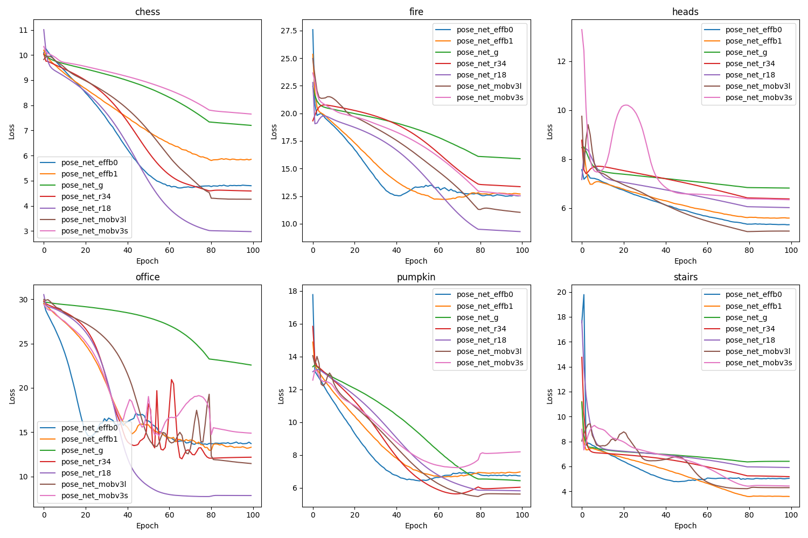
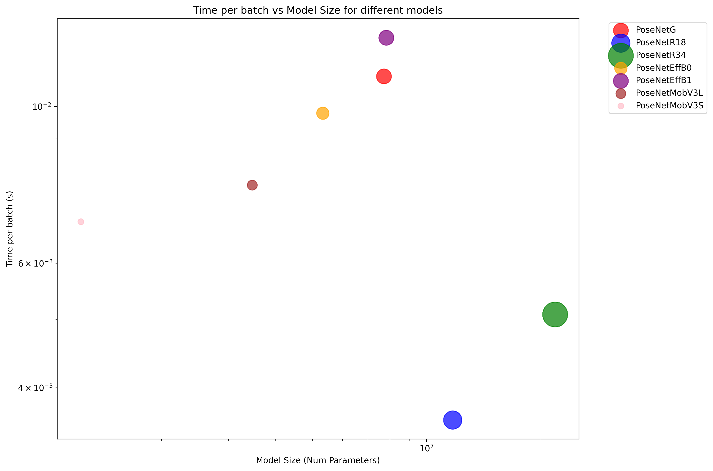

# CNN PoseNet Suite


This repository focuses on 6-DoF camera pose estimation using various deep learning models on the 7-Scenes dataset. Specifically, the repository expands on the original paper to train Posenets with different CNN backbones for performance comparison. The goal is to train models on each scene to predict the camera's position and orientation (pose) from a single RGB image.

Inference employs a moving average filter for translation and smoothing for quaternion to enable smooth trajectories. As seen from visualized results, the predicted pose due to accumulating drift results in the absolute pose differing from ground truth. However, relative pose transformation between frames for both predicted and ground truth pose is more similar (See trajectory between Frame 150 and 200).

### Performance
The following graphs illustrate the performance of the trained models on 6 of the 7 scenes and runtime performance relative to model parameter size.

**Per-Scene Losses**
This graph shows the translation and rotation errors for each model across the six scenes. The evaluation loss is evaluated with the cost function:
$$\mathcal{L} = \|\bar{x} - x\|+\beta\cdot\|\frac{\bar{p}}{\|\bar{p}\|} - p\|$$
where $\bar{x}$ and $\bar{p}$ are predictions from models, $x$ and $p$ are ground truth labels from dataset, and $\beta$ is the translation coefficient, set to 500 by default. More data during evaluation can be found under `resources`, with a more comprehensive `README.md` that displays the separate losses for each model.


**Runtime vs. Parameters**
This graph compares the runtime and number of parameters for each model. Models are evaluated with batch sizes of 128 with image resolutions at 224 x 224 on [NVIDIA GPU RTX 4090](https://www.videocardbenchmark.net/gpu.php?gpu=GeForce+RTX+4090&id=4606). Each model is represented as a circle, with its radius proportional to its model parameters. As seen from the graph, `ResNet` based PoseNets offer favorable runtime benefits, offering roughly 60% reduction in runtime compared to other models.


## Models
The following model architectures have been implemented and trained:
*   **EfficientNet:** B0, B1
*   **MobileNetV3:** Large, Small
*   **ResNet:** 18, 34
*   **GoogLeNet**

Configuration files for each model can be found in the `configs/` directory. Related weights are stored under `resources/weights/pose_net_x` where `x` represents the respective CNN backbone.

## Dataset

The models were trained and evaluated on the [7-Scenes dataset](https://www.microsoft.com/en-us/research/project/rgb-d-dataset-7-scenes/), a collection of RGB-D sequences from a handheld Kinect camera in seven different indoor scenes. 

**Note:** Due to corrupted data after training, the "red-kitchen" scene results was excluded from the evaluation process. The performance results presented are based on the remaining six scenes: "chess", "fire", "heads", "office", "pumpkin", and "stairs".

## Installation
1.  Clone the repository:
    ```bash
    git clone https://github.com/your-username/6DoF-Camera-Pose-Estimation.git
    ```
2.  Download data from Microsoft Website and execute data preparation for training: 
    ```bash
    bash 6DoF-Camera-Pose-Estimation/download.sh
    ```
3. Install the required packages:
    ```bash
    cd 6DoF-Camera-Pose-Estimation
    pip install -r requirements.txt
    ```

## Training
To train a model, use the `train.py` script with the desired model configuration file:
```bash
python3 -m src.train \
    --path data \
    --config configs/pose_net_x.yaml \
    --save ../models/pose_net_x \
```
where `x` is the respective model. Available models include `pose_net_effb0`, `pose_net_effb1`, `pose_net_g`, `pose_net_mobv3l`, `pose_net_mobv3s`, `pose_net_r18`, and `pose_net_r34`.

## Inference
After training a model, use the `inference.py` script to generate pose predictions for new images. The script processes a sequence of RGB images and outputs corresponding pose transformation matrices with optional smoothing and ground truth comparison.

### Basic Usage
```bash
python3 -m src.inference \
    --model configs/pose_net_r18.yaml \
    --w resources/weights/pose_net_r18/chess/pose_net_r18.pth \
    --img_dir "data/chess/seq-01" \
    --gtdir "data/chess/seq-01-gt"
```

### Command Line Arguments
- `--model`: Path to the model configuration file (required)
- `--img_dir`: Directory containing input RGB images (`.color.png` files) (required)
- `--w`: Path to trained model weights file (`.pth`)
- `--mdir`: List of directories for computing RGB mean normalization (optional, defaults to `--img_dir`)
- `--gtdir`: Directory containing ground truth poses for error evaluation (optional)
- `--translation_window`: Window size for moving average filter on translation (default: 10)
- `--rotation_weight`: Smoothing weight for SLERP rotation interpolation, 0-1 (default: 0.8)

### Output
The script generates:
1. **Pose files**: `.pose.txt` files for each input image containing 4×4 transformation matrices
2. **Error metrics** (if `--gtdir` provided): Mean and standard deviation for translation and rotation errors

### Pose Smoothing
The inference pipeline includes pose smoothing to reduce jitter and improve trajectory quality:
- **Translation smoothing**: Moving average filter over a configurable window
- **Rotation smoothing**: Spherical linear interpolation (SLERP) between consecutive quaternions

This smoothing is particularly beneficial for video sequences where temporal consistency is important.

### Visualize Trajectory
To visualize and compare predicted vs ground truth camera trajectories for a given scene, run the `visualize_trajectory.py` script. This creates a side-by-side comparison video showing the original RGB image, ground truth trajectory, and predicted trajectory in real-time.

For example:
```bash
python3 -m src.visualize_trajectory \
    --gt_dir "data/chess/seq-01-gt" \
    --pred_dir "data/chess/seq-01-prediction" \
    --img_dir "data/chess/seq-01" \
    --output "chess_trajectory_comparison.mp4"
```

**Arguments:**
- `--gt_dir`: Directory containing ground truth pose files (`.pose.txt`)
- `--pred_dir`: Directory containing predicted pose files (`.pose.txt`)  
- `--img_dir`: Directory containing corresponding RGB images (`.color.png`)
- `--output`: Output path for the comparison video (default: `trajectory_comparison.mp4`)

This creates a 3-panel video showing:
1. **Left panel**: Original RGB image for each frame
2. **Middle panel**: Ground truth camera trajectory with coordinate axes
3. **Right panel**: Predicted camera trajectory with coordinate axes

The visualization script expects each frame to have corresponding files with matching prefixes (e.g., `frame_000001.color.png` and `frame_000001.pose.txt`). Each pose file stores a $4\times 4$ transformation matrix representing the camera's position and orientation.
