# Model Performance Graphs

This directory contains training loss graphs for various model architectures used in 6DoF camera pose estimation. The graphs show the progression of translation loss, rotation loss, and total loss during training for each model.

## Model Comparison

### EfficientNet-B0
| Translation Loss | Rotation Loss | Total Loss |
|------------------|---------------|------------|
| 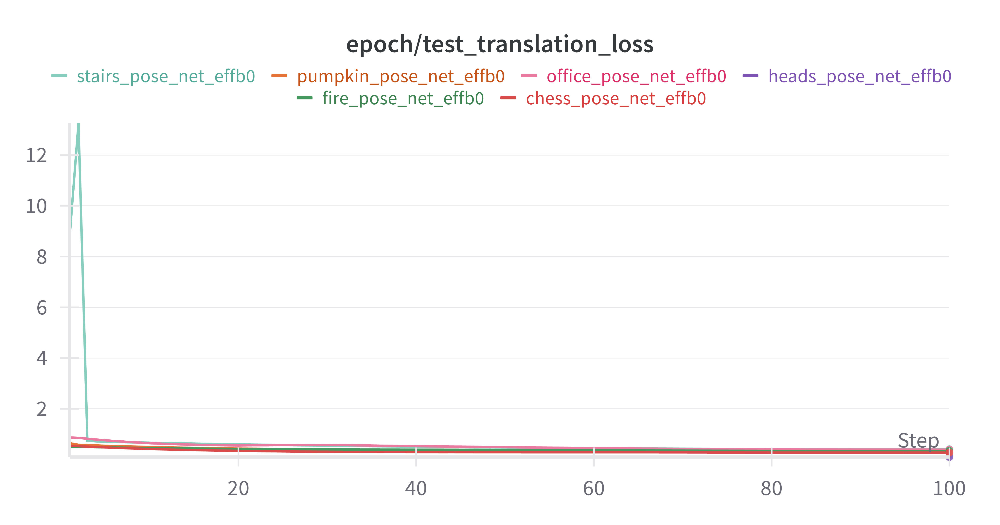 | 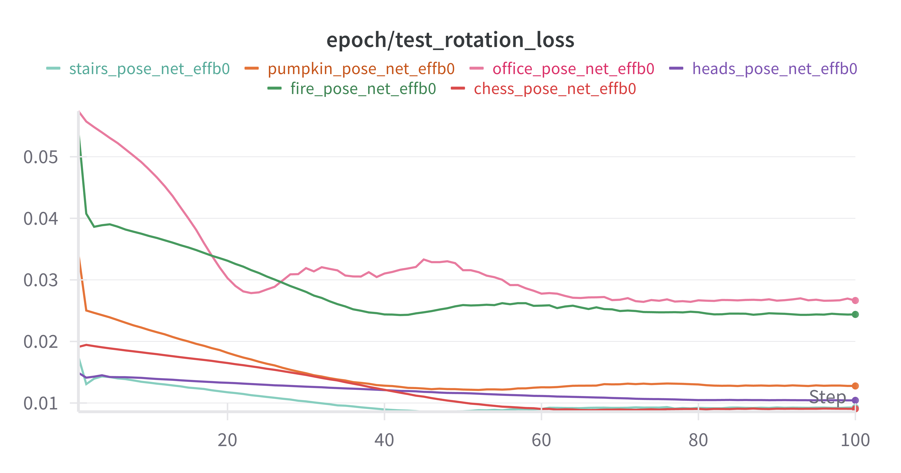 | 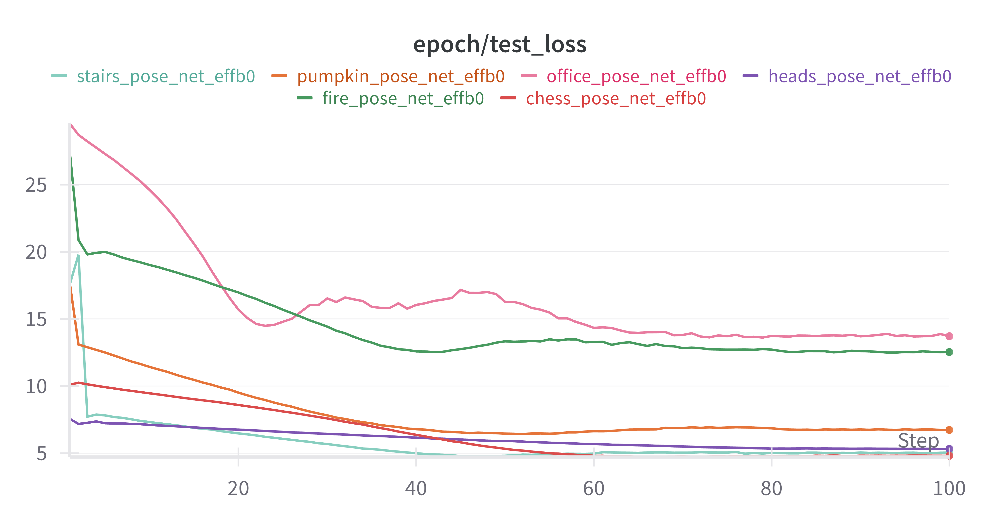 |

### EfficientNet-B1
| Translation Loss | Rotation Loss | Total Loss |
|------------------|---------------|------------|
| 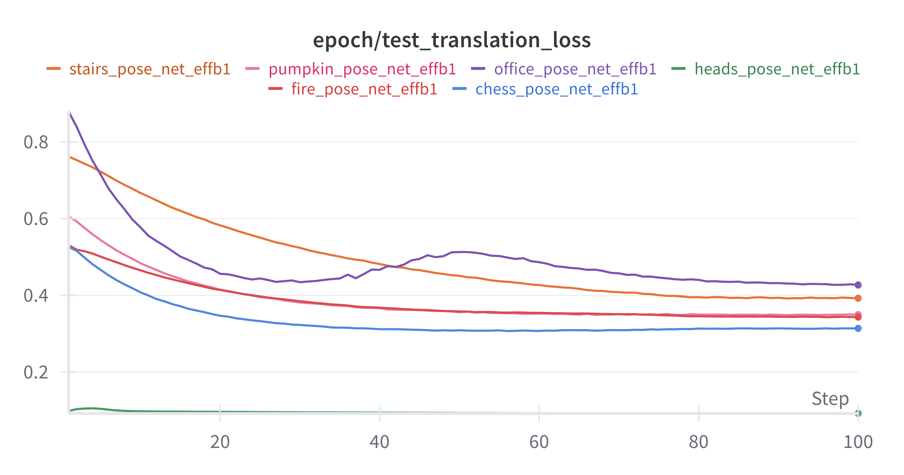 | 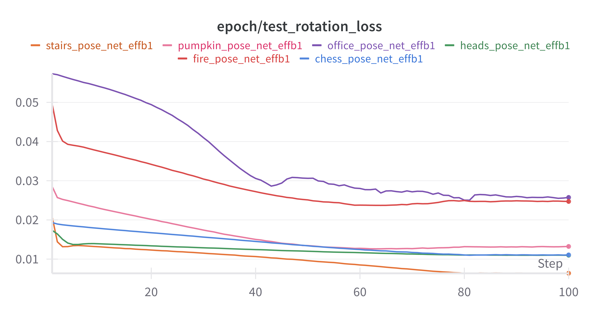 | 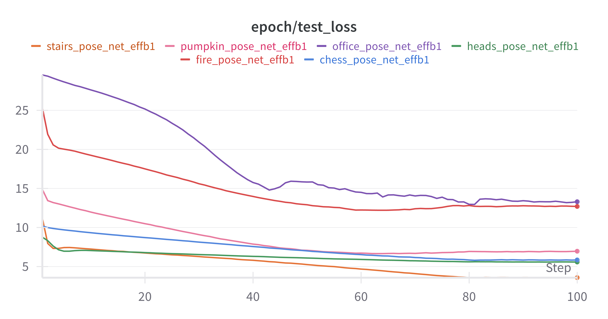 |

### GoogleNet
| Translation Loss | Rotation Loss | Total Loss |
|------------------|---------------|------------|
|  | 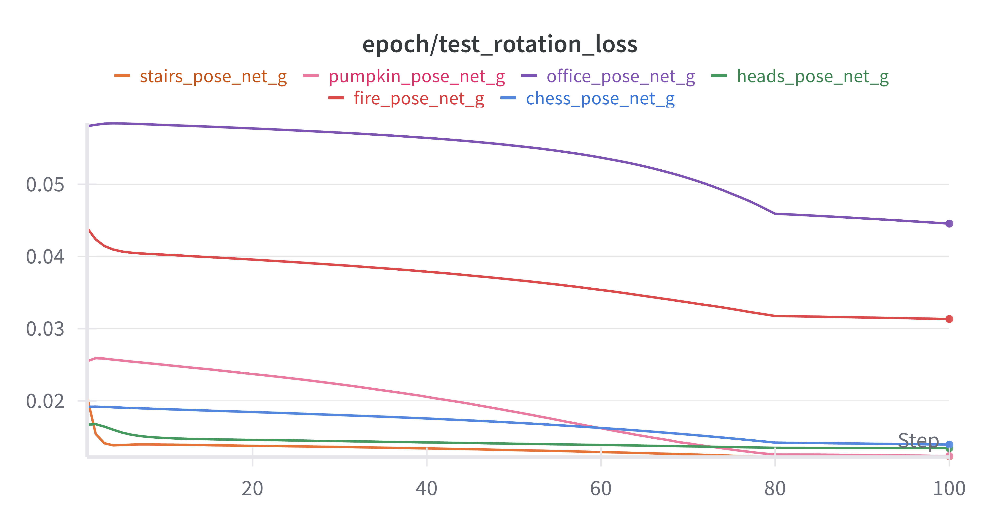 | 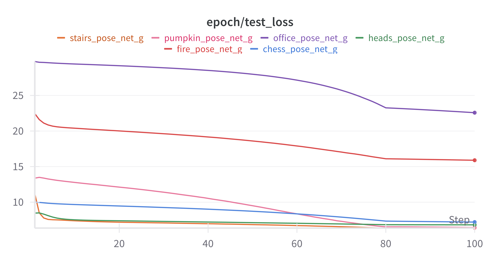 |

### MobileNetV3-Large
| Translation Loss | Rotation Loss | Total Loss |
|------------------|---------------|------------|
| 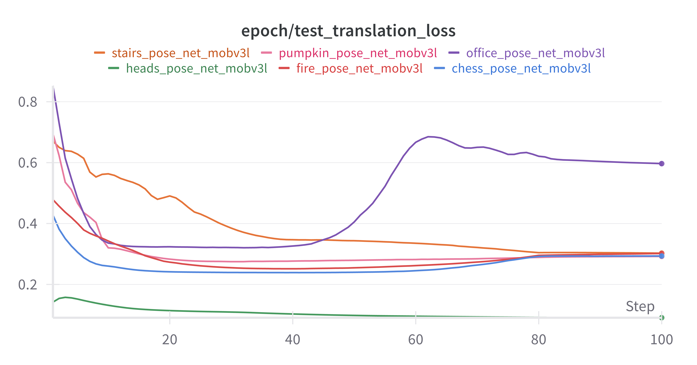 | 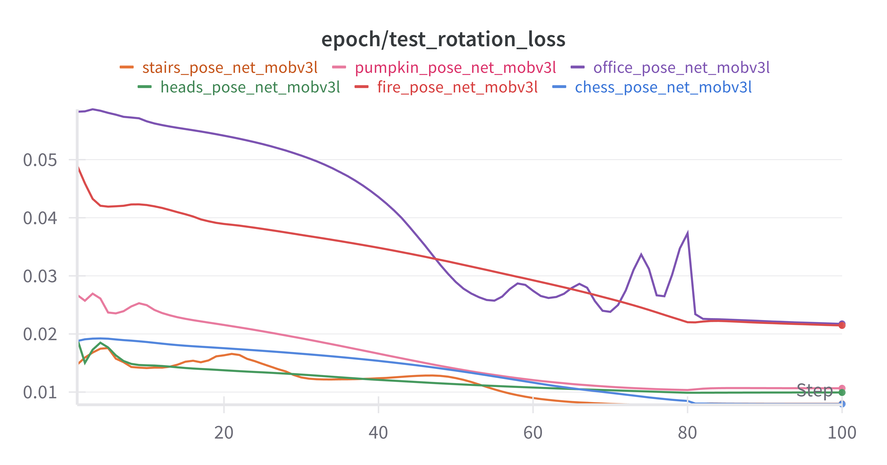 | 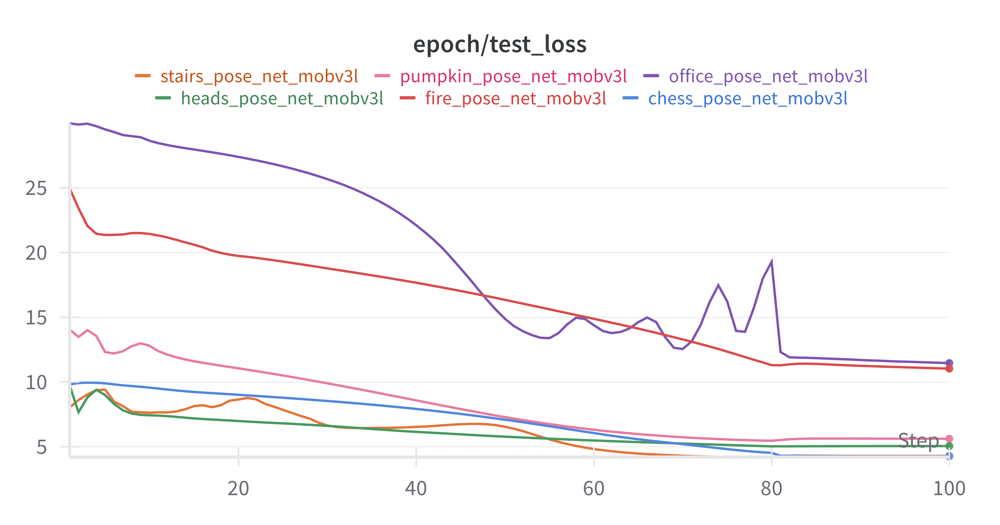 |

### MobileNetV3-Small
| Translation Loss | Rotation Loss | Total Loss |
|------------------|---------------|------------|
| 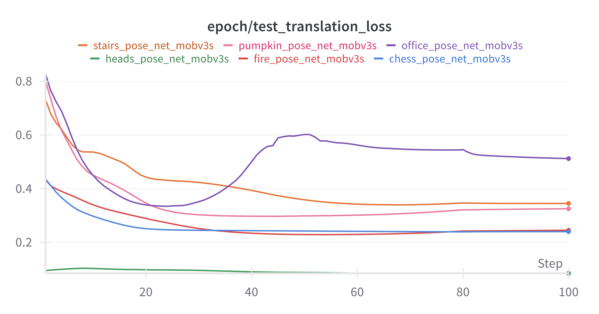 | 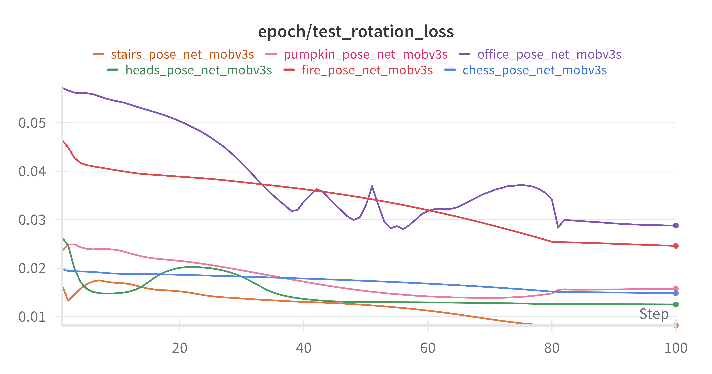 | 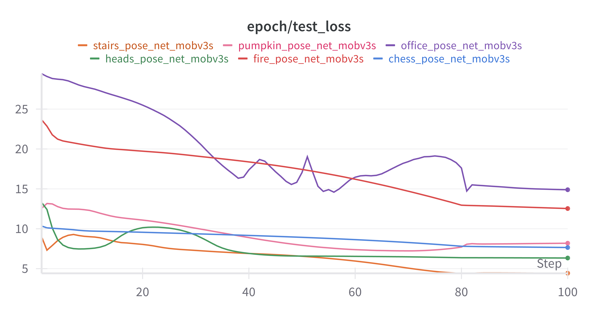 |

### ResNet-18
| Translation Loss | Rotation Loss | Total Loss |
|------------------|---------------|------------|
| 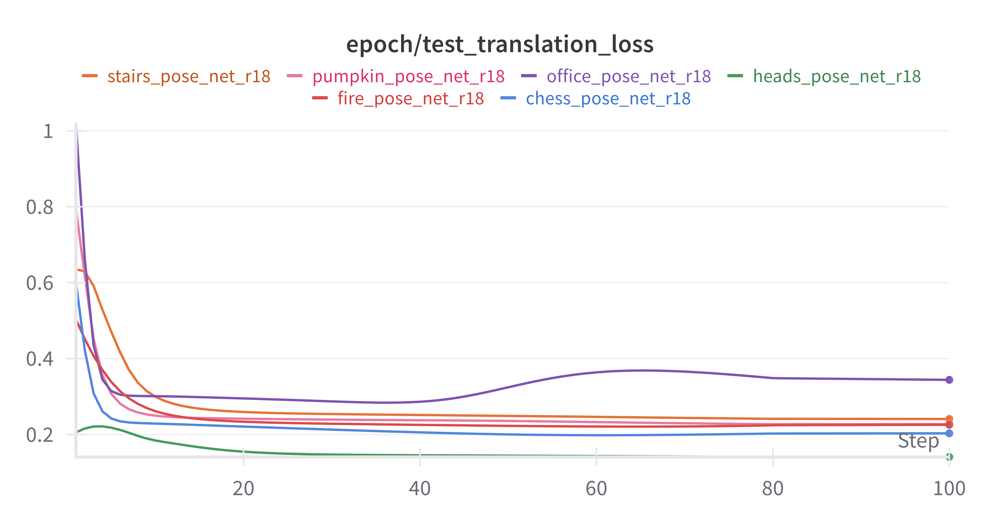 | 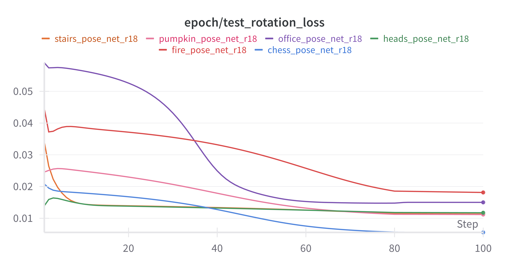 | 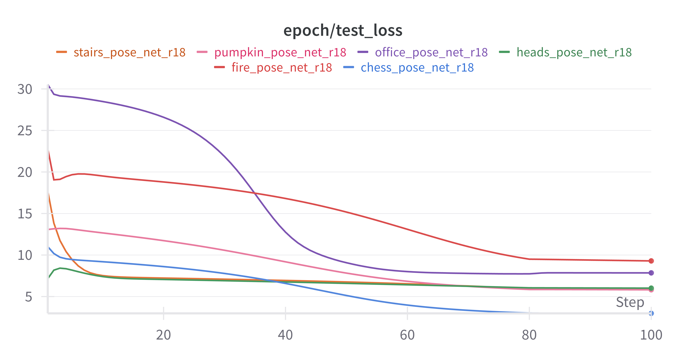 |

### ResNet-34
| Translation Loss | Rotation Loss | Total Loss |
|------------------|---------------|------------|
| 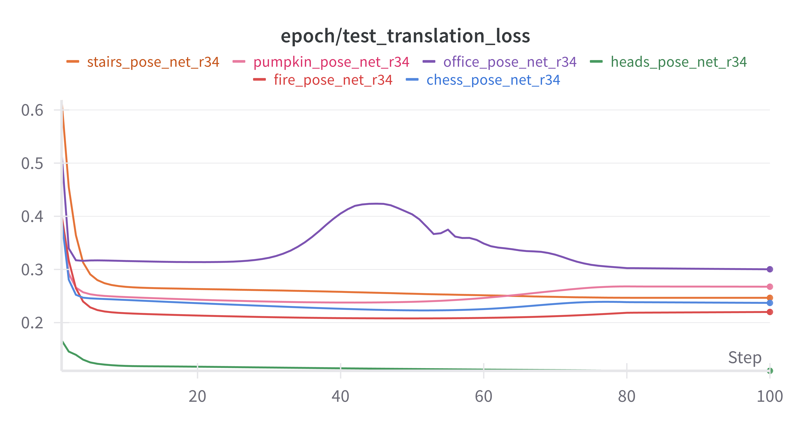 | 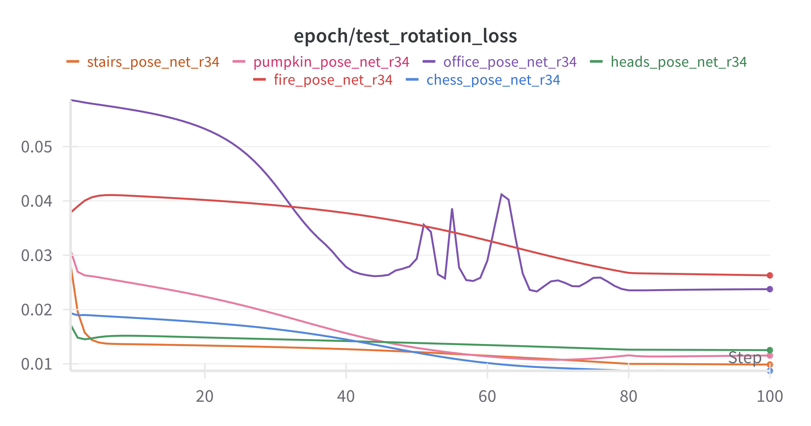 | 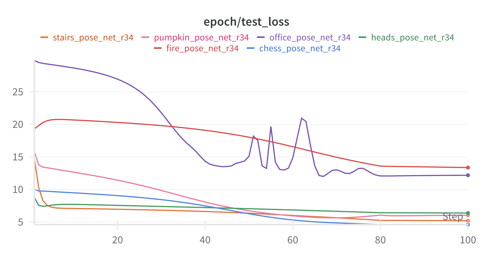 |